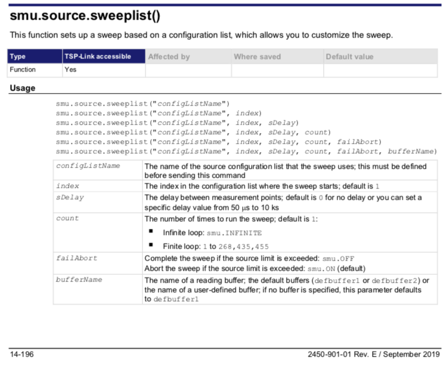
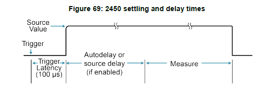

# Electrochemical impedance spectroscopy (EIS) on batteries with Keintly 2450

This project aims to perform a Electrochemical impedance spectroscopy (EIS) on a Li-Ion rechargeable battery using the Keithley 2450 Source Measure Unit (SMU) Instrument. Even the EIS is not among the applications listed in the official documentation,  the features of the instrument allow to perform the impedance measurement up to 100Hz.

The measurement of battery impedance is crucial for online monitoring of State of Charge and State of Health [(1)](docs/references.md#1). Lab measurements with Keithley 2450 can be used as bechmark to validate data from custom build impedence monitoring system such as [(2)](docs/references.md#2)

## Programming Keintly 2450 smu

Keintly 2450 can be operated using a remote command inteface, a local script or front panel. The Script Manager application can load and execute locally TSP scripts from USB storage device or from internal storage.

### Remote Operation

In remote operation mode a computer (controller) is programmed to send sequences of commands to an instrument.  The controller orchestrates the actions of the instrumentation. The controller is typically programmed to request measurement results from the instrumentation and make test sequence decisions based on those measurements.
Keintly 2450 support GPIB, SCPI, and TSP remote command set.

## The Test Script Processor (TSP®)

To take advantage of the advanced features of the instrument, you can add programming commands to your scripts. Programming commands control script execution and provide tools such as variables, functions, branching, and loop control.
The Test Script Processor (TSP®) scripting engine is a Lua interpreter. In TSP-enabled instruments, the Lua programming language has been extended with Keithley-specific instrument control commands.

### What is Lua?

Lua is a programming language that can be used with TSP-enabled instruments. Lua is an efficient scripting language with simple syntax and a complete functionality set.

## How To Prerform an EIS

Single-Sine EIS measurements involve applying a sinusoidal perturbation (voltage or current) and measuring the response (current or voltage respectively). See [EIS section](/docs/electrochemical-Impedance-spectroscopy.md) for more details.
There is no built in sinusoidal signale generation, so 50mA sinusoidal current signal has been generated using the source sweeplist function

The sweeplist function allow to go trough a list of source configuration and perfome a measure for each item of the list. Refere to the [getting started](docs/../getting_started.md) section for step-by-step guidance.

### Configuration List on Keintly 2450

A configuration list is a list of stored settings for the source or measure function. Configuration lists allow you to store the function settings of the instrument and then return the instrument to those settings as needed.
The instrument also uses configuration lists to manage the settings for sweeps.

A configuration index contains **a copy of all instrument source or measure settings at a specific point**.
Configuration lists are typically made up of multiple indexes.
You can store a **maximum of 300,000 indexes**.

Measure configuration lists contain the source/measure function setting and the settings for the source/measure function, such as the NPLC, display digits, and math settings.

In this project a source and measure configuration list is created with source value from [sinusoidal signal generation](sinusoidal-signal-generator.md) included in the tSP script.


## Source Settings

Source parameters must be set before the creation of the source configuration list.

For impedence estimation a current imput signal is sourced and a voltage on DUT terminals is measured.

```lua
 smu.source.func = smu.FUNC_DC_CURRENT
 smu.source.readback = smu.ON
 smu.source.vlimit.level = 21 -- [V]
 smu.source.autorange = smu.OFF
 smu.source.range = 0.010 --[A]
 smu.source.delay = 0 -- [s]
```

`smu.source.readback = smu.ON` mean that the output of the measure will include the measured source singal levels while with `smu.source.readback = smu.OFF` the programmed value is used. The source signal measure is executed immidiatly before the measure signal measuremnt. This additional measure require some time and increase the overall time required for each messuremt.

`smu.source.autorange = smu.OFF` disables the autorange function to avoid delay during range changes. A fixed `smu.source.range = 0.010` is therfore used.

`smu.source.delay=0` allow to control the delay between two measures only with `delay` paramer `function`.

### NPLC

NPLC Set the amount of time that the input signal is measured. Lower NPLC settings result in faster reading rates, but increased noise. Higher NPLC settings result in lower reading noise, but slower reading rates.

The amount of time is specified in parameters that are based on the number of power line cycles (NPLCs). Each power line cycle for 60 Hz is 16.67 ms (1/60); for 50 Hz, it is 20 ms (1/50).

### Source Delay e frequenza di campionamento per EIS

Tra le diverse misurazioni è necessario introdurre un ritardo (`smu.sorce.delay`) per permettere alla sorgente di corrente raggiungere il livelo programmato e stabilizzarsi.

Lo strumento sarebbe in grado di eseguire le misure di tensione ai terminal del DUT con un intervallo di circa 1mS, ma l'intervallo di campionamento non è costante.

I dati raccolti mostrano che l'intervallo minimo che è possibile ottenere con `smu.source.readback = smu.ON`, `nplc=0.01`  e le forme d'onda sinusoidali nel range di frequenze utilizzate per l'esperimento è variabile e compreso tra 1ms e 3ms

 La variabilità assoluta dell'intervallo di campionamento sembra  essere indipendente dal valore del paramtro `smu.sorce.delay` almeno per valori comoresi tra 0 e 10.

L'intervallo tra due misure consecutive in un list sweep è la somma di due distinti delay: sweep delay (parametro sDelay dello sweep) e source delay .

#### Sweep Delay

Il parametro sDelay può essere impostato a 0 oppure ad un valore tra 50microS e 10Ks.  (pag. 14-196 del manuale di riferimento)



Lo sweep delay si va sempre a sommare al source delay.

#### Source delay

Il source delay è la somma di tre componenti (vedi "source delay" a  pag 4-46 del manuale di riferimento):

  

1. trigger Latency (100 micro secondi non modificabile)
2. source delay / autodelay
3. measure time

#### Autodelay

Anche se il _source delay_ è configurato a zero (`smu.source.delay=0`) viene inserito automaticamente un delay (autodelay) che dipende dal valore della corrente.
**Attenzione che i valori riportati nella tabella a pag. 4-46 sono validi per reaback = false.**
Con readback=true non è chiaro qualse sia il valore dell'autodelay. La mia ipotesi che il _measure time_ debba essere contato due volte (una per la tensione e una per la corrente).

#### Measure Time

Il measure time dipende dal parametro nplc.  NPLC =0.01 => 167microSecondi Con alimentazione 60Hz , e 200 microSecondi con al nostra 50Hz (ammesso che sia veramente 50Hz .... sarebbe da misurare questo parametro visto che localmente ci possono essere scostamenti notevoli) . 
Prendendo per buoni i 50Hz con il readback attivo dovrebbero venire fuori 400microSecondi per la componente "measure time".

Il valore sale a 2ms per nplc=0.05  (0.05/50)*2 =0.002 s

#### SweepDealy and NPLC parameters

Impostando un `sweep delay=0.01` si ottiene un intervallo di campionamento pari a circa 10-12ms per  tutte le frequenza testate tra 0.05Hz e 40Hz

Questa scelta consente inoltre di utilizzare un valore  di nplc più elevato per aumentare ridurre la rumososità della misura senza limitare in maniera significativa l'analisi spettrale.

I due valori permettono un trade-off tra frequenza di campionamento e rumorosità della misura. Negli esperimenti sono state provate ad esempio le combinaizoni:

- `sweep delay=0.01 , nplc=0.1` permette di ottenere ottenere un intervallo di campionamento di 15ms con variabilità inferiore ad 1ms.
- `sweep delay=0.005 , nplc=0.04` permette di ottenere ottenere un intervallo di campionamento di circa 7ms con variabilità inferiore ad 1ms
- `sweep delay=0.005 , nplc=0.05` permette di ottenere ottenere un intervallo di campionamento di circa 7.5ms con variabilità inferiore ad 1ms

Il valore esatto delle frequnaza di campionamento dipende dalla frequenza della tensione che alimenta lo strumento e non è quindi determinabile a priori con precisione. Approssimativamente 50Hz in Italia, ma localmente si possono verificare scostamenti significativi.


## Measure Settings

```lua
 smu.measure.func = smu.FUNC_DC_VOLTAGE
 smu.measure.autorange = smu.OFF
 smu.measure.range = 5 [V]
 smu.measure.nplc = 0.01
 smu.measure.sense=smu.SENSE_4WIRE
 smu.measure.autozero.once()
```

### Measure Range

Measurement range should match the output signal range to obtain the best SNC. The fixed current source ranges are 10 nA, 100 nA, 1 microA, 10 microA, 100 microA, 1 mA, 10 mA, 100 mA, and 1 A
