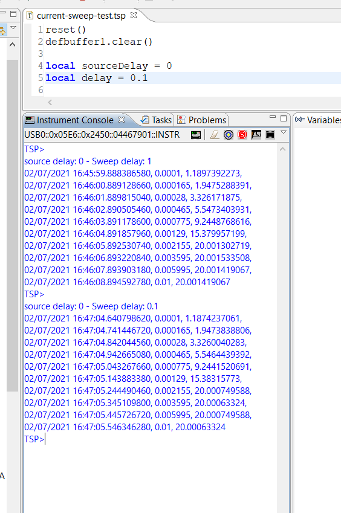
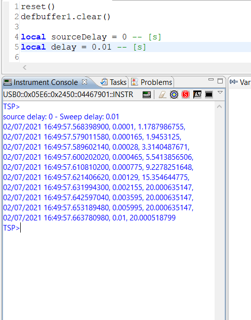
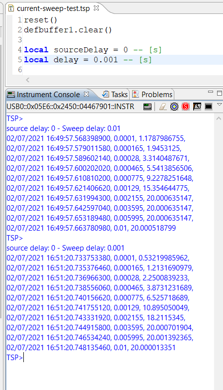
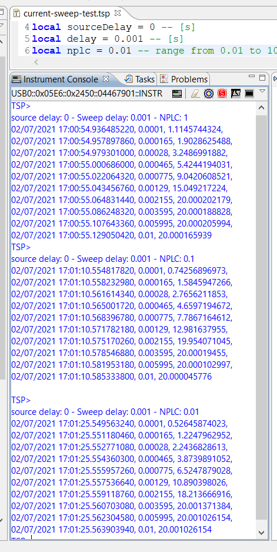
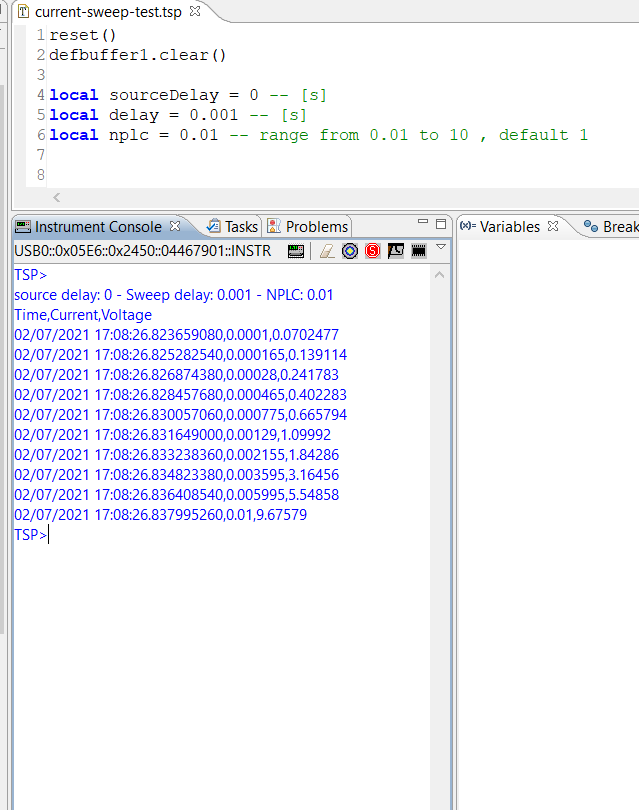

# Current Sweep Speed Test

Esecuzione di un source current sweep per verificare la velocità dello strumento nel produrre la forma d'onda richiesta e nell'eseguire la misura

```lua
-- -------------------------------------
-- SOURCE SETTIGNS

smu.source.func = smu.FUNC_DC_CURRENT
smu.source.range = 100e-3
smu.source.vlimit.level = 20

-- setting for maximum speed 
smu.source.delay=sourceDelay
smu.source.readback = smu.OFF

-- -------------------------------
-- Measure setting

smu.measure.func = smu.FUNC_DC_VOLTAGE
smu.measure.sense=smu.SENSE_4WIRE
smu.measure.range = 10

-- settings for maximum speed
smu.measure.nplc = nplc
smu.measure.autozero.enable = smu.OFF
smu.measure.autozero.once()


smu.source.sweeplog("RES", 100e-6, 10e-3, 10, delay, 1, smu.RANGE_BEST, smu.OFF)
trigger.model.initiate()
waitcomplete()
```

## Configurazione per massima velocità

Lo strumento mette a disposizione diversi parametri per sceglire il compromesso desiderato tra la precisione della msiurazione e la velocità meòò'esecuzione delle mesure. In questo esperimento si è cercato di spingere al massimo la velocità agendo sui seguenti parametri di configurazione:

- smu.source.delay
- smu.source.readback = smu.OFF
- smu.measure.nplc
- smu.measure.autozero

L'esperimento è stato ripetuto con diverse combinazioni dei parametri `nplc e delay` utilizzando un carico puramente resistivo ed un carico costituito da un parallelo RC.

## Risultati

Di seguit0 un sintesi dei rusltati degli eseprimenti eseguiti. I dati sono disponibili due della cartella current speed test]

- [carico resistivo 10Kohm](../current-sweep-speed-test/current_sweep_test_R10K_LOAD.txt) 
- [carico RC](../current-sweep-speed-test/current_sweep_test_R10K_LOAD.txt)

### Delay 1s - 0.1 s

Programmando lo sweep con un delay di 1s e di 0.1s lo strumento riesce ad eseguire le misure rischieste con un timing sostanzialmente preciso, rispettando l'intervallo di campionamento.



Riducendo il ritardo a 10ms (0.01s) i timing delle misure è preciso fino alle seconda cifra decimale, ma si notano delle irregolarità enll'intervallo sulla terza cifra decimale



I limiti di precisone a livello risultano evidenti riducendo il ritardo a 1ms (0.001s): l'intervallo tra due diverse misure è sempre superiore a 1ms



Per cercare indagare sulla possibilità di spingere al massimo le velocità a discapito della precisione sono stati condotti altri espeimenti modificanado anche il parametro `nplc` rispetto al valore di default `nplc=1`



Putroppo neppure impostando il valore minimo consentito `nplc=0.01` si riesce ad ottenre un intervallo campionamento costante di 1ms
 

![sweep test - delay 1ms]

### Conclusioni

Non è stato possibile generare un segnale in corrente e misurare la sensione con intervalli di campionamento precisi al di sotto di alcuni ms.
