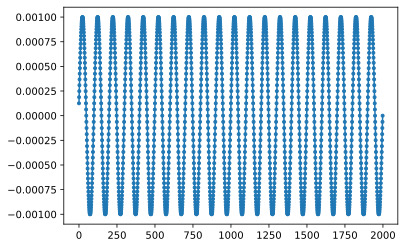
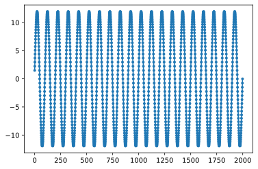

# Frequency Sweep generator

Frequency sweep step calculation function

```lua
function generateFreqSweep(freqSweepStart,freqSweepStop,freqSweepStep)
 local freqSweep = {}
 local next = freqSweepStart
 local fIndex = 0
 
 while next <= freqSweepStop do
   freqSweep[fIndex] = next
   next = next+freqSweepStep
   fIndex = fIndex+1
 end
 return freqSweep
end
```

Frequency sweep generation sample:

```lua

local freqSweepStart = 0.1
local freqSweepStop = 0.2
local freqSweepStep = 0.1

local currentLevels = {}
local signalSampleIndex=0

local stepN = math.floor((freqSweepStop - freqSweepStart)/freqSweepStep)
print("Frequency sweep. start: %g, stop: %g , step: %g",freqSweepStart,freqSweepStop,freqSweepStep)
local sweep = generateFreqSweep(freqSweepStart,freqSweepStop,freqSweepStep)

for sweepIndex=0,stepN do
 local freq = sweep[sweepIndex]
 local generatedSignal = generateSinusoidalSignal(sampleTime,freq,A,po,b)
 for i, value in generatedSignal do
   currentLevels[signalSampleIndex]= value
   signalSampleIndex = signalSampleIndex+1
  end
end
```

## Current Sweep 10K Resistive load

Di seguito i risultati di una misura eseguita con `dealy == 0.01s e nplc = 0.01` su carico resistivo da 10Kohm





I dati acquisiti sono nel file [sweep test R10K load](../data/sweep_test_R10K_load.csv)

```csv

                          timestamp       current   voltage
0     02/07/2021 18:53:28.161005260  1.253410e-04  1.499570
1     02/07/2021 18:53:28.173474380  1.874520e-04  2.239640
2     02/07/2021 18:53:28.185904860  2.487170e-04  2.972470
3     02/07/2021 18:53:28.198331920  3.090590e-04  3.692990
4     02/07/2021 18:53:28.210758080  3.681550e-04  4.398110
...                             ...           ...       ...
1994  02/07/2021 18:54:10.897382020 -2.487020e-04 -2.969940
1995  02/07/2021 18:54:10.909798880 -1.873780e-04 -2.238570
1996  02/07/2021 18:54:10.922236400 -1.253170e-04 -1.497440
1997  02/07/2021 18:54:11.012413320 -6.279020e-05 -0.750214
1998  02/07/2021 18:54:11.251590480 -1.534770e-12  0.000114

[1999 rows x 3 columns]
```
